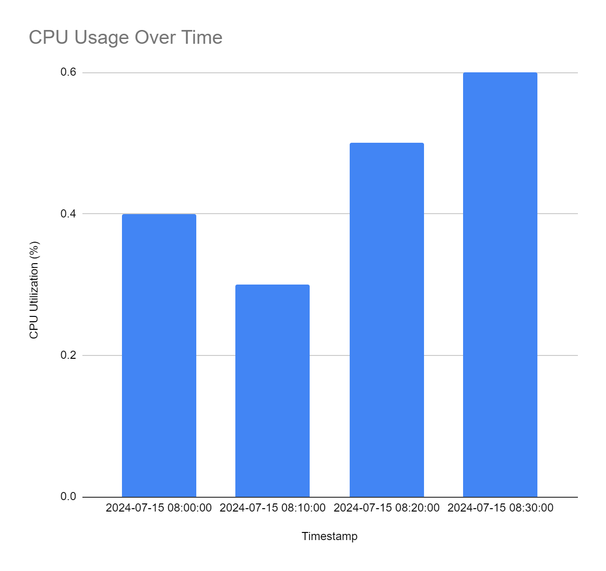

# Power-manager-telemetry
The Power Manager Telemetry project aims to monitor and measure the power consumption and performance of system components, specifically the CPU, memory, NIC, and TDP. This project uniquely integrates stress testing via Docker containers with real-time telemetry data collection and power measurement. It provides a comprehensive view of system performance and energy consumption under high load conditions. The automation of this process ensures repeatability and accuracy in monitoring and reporting system power utilization.
 
<h2> Features </h2>
<li>Telemetry Data Collection: Collects telemetry data for system components including CPU, memory, NIC, and TDP.</li>
<li>Stress Testing: Utilizes Docker containers to simulate 100% system utilization.</li>
<li>Power Measurement: Measures system power utilization and generates detailed reports.</li>
<li>Custom Utilization Input: Allows input of desired system utilization percentage to measure power consumption.</li>
<li>Automated Process: Automates the entire process from stress testing to telemetry data collection and reporting.</li>
 
<h2>Architecture</h2>
The architecture of this project includes the following components:

<li>Docker Containers: Used to create a controlled environment for stress testing the system components.</li>
<li>Telemetry Collection Scripts: Python scripts that utilize psutil to collect real-time telemetry data for CPU, memory, NIC, and TDP.</li>
<li>Power Measurement Scripts: Python scripts that measure the power consumption of the system components during stress tests.</li>
<li>Report Generation Scripts: Python scripts that compile the collected telemetry data and power measurements into a detailed report.</li>
<h2>Technologies Used</h2>
<li>Python: The main programming language used for writing telemetry collection, power measurement, and report generation scripts.</li>
<li>Docker: Used to create containers for stress testing the system components.</li>
<li>psutil: A Python library used to retrieve information on system utilization (CPU, memory, NIC).</li>
<li>Stress-ng: A tool used within Docker containers to apply stress on the system components.</li>
<h2> Installation </h2>
<h3> Prerequisites </h3>
<li>Python 3.8+</li>

<h2>Directory Structure</h2>

    power_manager_telemetry/
    │
    ├── Dockerfile
    ├── stress_test/
    │   ├── Dockerfile
    │   └── run_stress.sh
    ├── scripts/
    │   ├── collect_telemetry.py
    │   ├── measure_power.py
    │   └── generate_report.py
    ├── telemetry_data.json
    ├── report.json
    ├── requirements.txt
    └── README.md
<h2>How to Run the Project </h2>
To run your Power Manager Telemetry project and achieve the expected outcomes, follow these steps:

<h3>1. Setting Up the Environment</h3>
       Ensure you have Docker installed and configured. Additionally, make sure Python and necessary packages (psutil for telemetry data collection) are installed. 

<li>Install Docker:</li>

    sudo apt-get update
    sudo apt-get install docker.io
    sudo systemctl start docker
    sudo systemctl enable docker

<li>Install Python Packages:</li>

    pip install psutil

<h3>2. Running the Project</h3>
    Step-by-Step Execution:
    <li>Step 1: Build and Run the Stress Container</li>
 
 Build and run the Docker container (stress-container) to simulate high system utilization.
 
    # Navigate to stress_test directory
    cd power_manager_telemetry/stress_test

    # Build the stress container
    docker build -t stress-container .

    # Run the stress container to simulate high system utilization
     docker run --rm -it stress-container

   <li>Step 2: Collect Telemetry Data</li>
 While the stress container is running, collect telemetry data using collect_telemetry.py.

    # Navigate to scripts directory
    cd ../scripts

    # Run collect_telemetry.py to gather telemetry data
    python collect_telemetry.py

   <li>Step 3: Measure Power Utilization</li>

 Measure power utilization based on system utilization using measure_power.py.

    # Run measure_power.py to measure power utilization
    python measure_power.py

<h3>3. Viewing Telemetry Data</h3>
  The telemetry data is stored in ../telemetry_data.json. You can view this file to see the collected metrics including CPU percent, memory used, network bytes sent, and any 
  additional metrics you've added.
 
<h3>5. Generating Reports (Optional)</h3>
If you have a script to generate reports (generate_report.py), you can run it after collecting telemetry data to create detailed reports based on the captured metrics.
 
<h3>Notes:</h3>
<li>Ensure you have appropriate permissions to run Docker commands and access system metrics.</li>
<li>Modify the scripts (collect_telemetry.py, measure_power.py) as needed to include additional telemetry metrics or adjust measurement logic.</li>
<li>Test each step to ensure the scripts work correctly in your environment, especially regarding Docker containerization and telemetry data collection.</li>
By following these steps, you can effectively run your Power Manager Telemetry project and achieve the specified outcomes related to telemetry data collection and power utilization measurement.

<h2>Telemetry Data</h2>
The telemetry data collected during the stress test includes metrics for CPU utilization, memory usage, and network I/O. Below is a summary of the key metrics:
   
  <table>
  <thead>
    <tr>
      <th>Metric</th>
      <th>Value</th>
    </tr>
  </thead>
  <tbody>
    <tr>
      <td>CPU Utilization</td>
      <td>0.4%</td>
    </tr>
    <tr>
      <td>CPU Cores</td>
      <td>12</td>
    </tr>
    <tr>
      <td>CPU Frequency</td>
      <td>0.805 GHz</td>
    </tr>
    <tr>
      <td>Memory Total</td>
      <td>16,439,758,848 bytes</td>
    </tr>
    <tr>
      <td>Memory Available</td>
      <td>12,965,339,136 bytes</td>
    </tr>
    <tr>
      <td>Memory Usage</td>
      <td>21.1%</td>
    </tr>
    <tr>
      <td>Network Bytes Sent</td>
      <td>68,683,102 bytes</td>
    </tr>
    <tr>
      <td>Network Bytes Received</td>
      <td>497,338,054 bytes</td>
    </tr>
  </tbody>
</table>

<h2>Power Utilization</h2>
The power consumption measured for different system components is summarized below:

<table>
  <thead>
    <tr>
      <th>Component</th>
      <th>Power Consumption (Watts)</th>
    </tr>
  </thead>
  <tbody>
    <tr>
      <td>CPU</td>
      <td>64.0 W</td>
    </tr>
    <tr>
      <td>NIC</td>
      <td>40.0 W</td>
    </tr>
    <tr>
      <td>TDP</td>
      <td>56.0 W</td>
    </tr>
  </tbody>
</table>

<h2>Graphs and Charts</h2>
   	<li>CPU Utilization Over Time</li>
CPU utilization over time shows how actively the CPU is being used at different intervals.CPU utilization ranged from 0.4% to 0.6% over successive timestamps (08:00:00, 08:10:00, 08:20:00, 08:30:00). 
     
 

